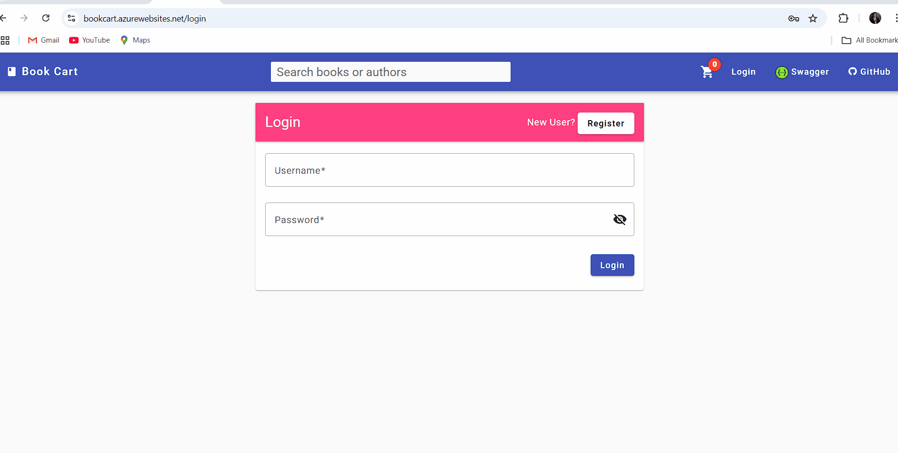
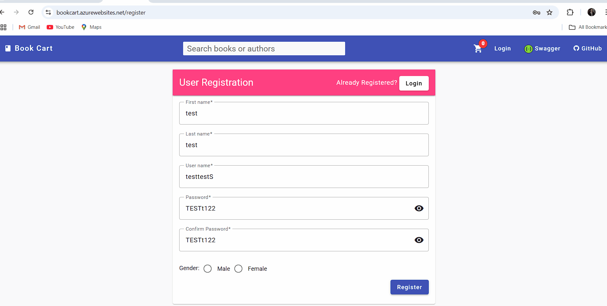

## [BUG] Flaky Registration Functional Test: Intermittent Pass/Fail

### Description
The automated registration functional test (`test_registration_functional`) is flaky: it sometimes passes and sometimes fails. The failure occurs at the login step immediately after registration, where the API returns 401 Unauthorized, although registration returns 200 OK and the payload is valid.

### Steps to Reproduce
1. Run the automated test: `test_registration_functional` (see `tests/test_registration.py`).
2. See that the test will sometimes pass and sometimes fail (no code changes between runs).
3. When it fails, the login step after registration returns 401 Unauthorized.

### Expected Behavior
- After successful registration (200 OK), login with the same credentials should always succeed immediately.

### Actual Behavior
- Sometimes login succeeds, sometimes it fails with 401 Unauthorized immediately after registration.

### Additional Notes
- **Same flaky behavior observed during manual testing via Swagger UI** - registration sometimes succeeds but immediate login fails with 401, confirming this is not an automation-specific issue.

### Impact
- Automated test suite is unreliable.
- Cannot guarantee that registration flow is stable for end users.

### Screenshots/Evidence

*Screenshot showing manual registration and login test via Swagger UI*

---

## [BUG] UI Login Error Handling: No User Feedback on Invalid Credentials

### Description
During exploratory testing of the Book Cart UI application, when attempting to login with incorrect credentials (invalid username/password), clicking the login button results in no visual feedback or error message being displayed to the user. The page remains static without any indication of the failed login attempt.

### Steps to Reproduce
1. Navigate to the Book Cart application login page
2. Enter invalid username and/or password credentials
3. Click the "Login" button
4. See that no error message or visual feedback appears
5. The page remains unchanged, potentially confusing the user about the login status

### Expected Behavior
- After clicking login with invalid credentials, an error message should be displayed

### Actual Behavior
- No error message appears after clicking login with invalid credentials

### Impact
- Poor user experience during login process
- Violation of basic UI/UX principles

### Severity
**Medium** - Affects user experience but doesn't prevent core functionality

### Environment
- **Application:** Book Cart UI (Frontend)
- **Browser:** Any modern web browser
- **Reproducible:** Yes, consistently reproducible

### Screenshots/Evidence

*GIF showing the login bug - no error message appears when invalid credentials are entered*

---

## [BUG] UI Registration Form: No Validation Feedback for Required Gender Field

### Description
During exploratory testing of the Book Cart UI registration form, when a user fills out all required fields but forgets to select a gender option (which is mandatory), clicking the "Register" button results in no visual feedback or error message. The form submission appears to be ignored without any indication of what went wrong.

### Steps to Reproduce
1. Navigate to the Book Cart application registration page
2. Fill out all required fields (first name, last name, username, password)
3. Leave the gender field unselected (no option chosen)
4. Click the "Register" button
5. See that no error message or validation feedback appears
6. The form remains unchanged, potentially confusing the user about the registration status

### Expected Behavior
- After clicking register with missing gender selection, a validation error message should be displayed

### Actual Behavior
- No error message appears after clicking register with missing gender

### Impact
- Poor user experience during registration process

### Severity
**Medium** - Affects user experience but doesn't prevent core functionality

### Screenshots/Evidence

*GIF showing the registration bug - no validation message appears when gender field is not selected*
