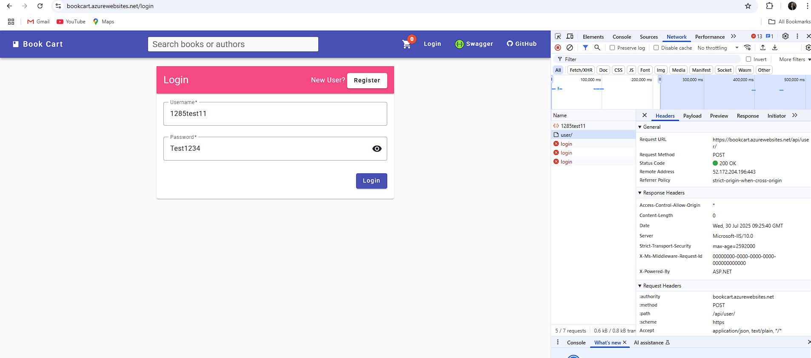

## [BUG] Flaky Registration Functional Test: Intermittent Pass/Fail

### Description
The automated registration functional test (`test_registration_functional`) is flaky: it sometimes passes and sometimes fails. The failure occurs at the login step immediately after registration, where the API returns 401 Unauthorized, although registration returns 200 OK and the payload is valid.

### Steps to Reproduce
1. Run the automated test: `test_registration_functional` (see `tests/test_registration.py`).
2. See that the test will sometimes pass and sometimes fail (no code changes between runs).
3. When it fails, the login step after registration returns 401 Unauthorized.

### Expected Behavior
- After successful registration (200 OK), login with the same credentials should always succeed immediately.

### Actual Behavior
- Sometimes login succeeds, sometimes it fails with 401 Unauthorized immediately after registration.

### Additional Notes
- **Same flaky behavior observed during manual testing via Swagger UI** - registration sometimes succeeds but immediate login fails with 401, confirming this is not an automation-specific issue.

### Impact
- Automated test suite is unreliable.
- Cannot guarantee that registration flow is stable for end users.

### Screenshots/Evidence

*Screenshot showing manual registration and login test via Swagger UI*

